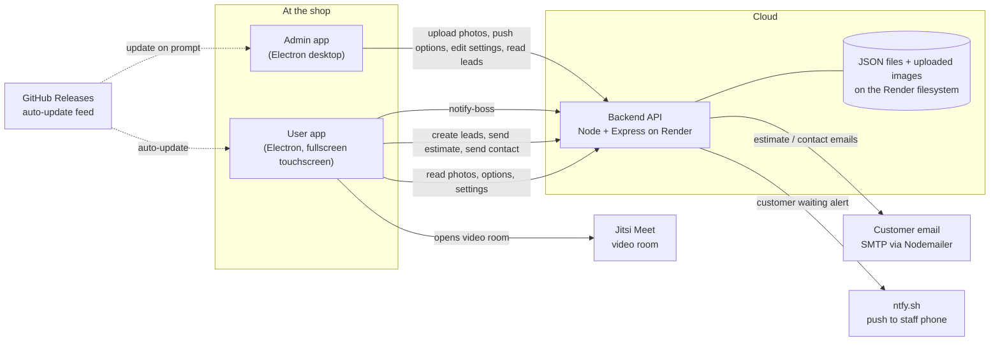
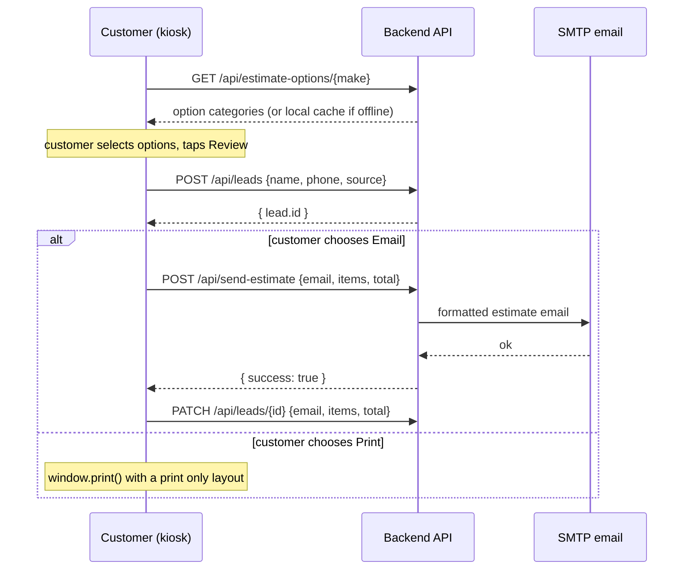
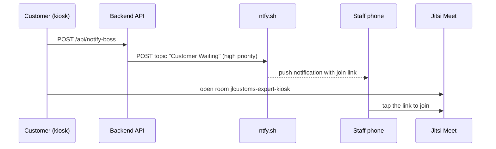
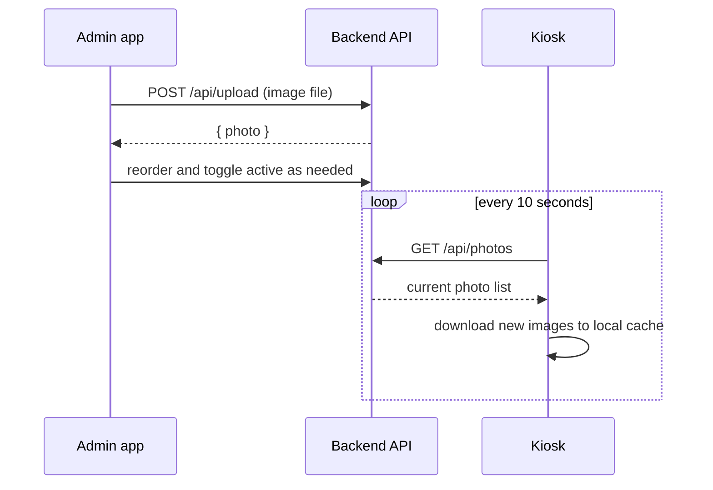
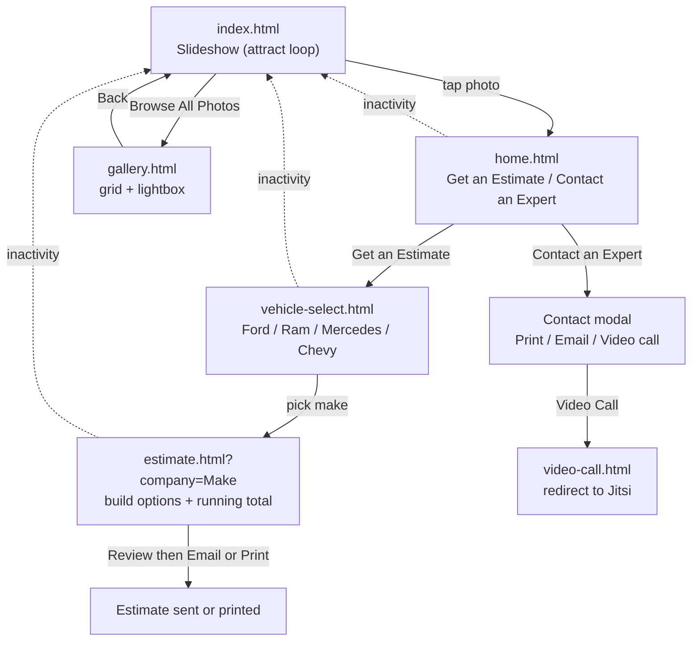
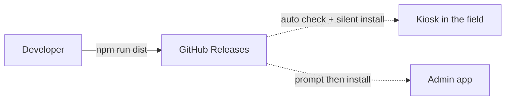

# JL Customs Interactive Kiosk

An in-store, touchscreen kiosk system for **JL Customs**. A customer walks up to a screen in the showroom, browses photos of past builds, configures an estimate for their own vehicle, and either emails or prints it or starts a live video call with an expert. Staff manage everything (gallery photos, build options, pricing, and customer leads) from a separate desktop admin app.

This document explains the whole system end to end so a new developer can get oriented quickly.

---

## Table of contents

1. [What the system does](#what-the-system-does)
2. [High level architecture](#high-level-architecture)
3. [Repository layout](#repository-layout)
4. [The three applications](#the-three-applications)
5. [Backend API reference](#backend-api-reference)
6. [Data models](#data-models)
7. [Key end to end flows](#key-end-to-end-flows)
8. [The kiosk navigation flow](#the-kiosk-navigation-flow)
9. [Offline resilience](#offline-resilience)
10. [Local development](#local-development)
11. [Build and deployment](#build-and-deployment)
12. [Configuration reference](#configuration-reference)
13. [Conventions and gotchas](#conventions-and-gotchas)
14. [Troubleshooting](#troubleshooting)

---

## What the system does

There are three moving parts and several external services.

| Part | What it is | Where it runs |
| --- | --- | --- |
| **User app** | The customer facing kiosk. A fullscreen Electron app. | A touchscreen at the shop |
| **Admin app** | Staff dashboard for photos, options, settings, and leads. An Electron desktop app. | A staff laptop or PC |
| **Backend** | A Node and Express REST API plus image host. | Render (cloud) |
| ntfy.sh | Push notifications to a staff phone when a customer wants a video call. | External service |
| Jitsi Meet | The actual video call room. | External service |
| SMTP server | Sends estimate and contact emails to customers, via Nodemailer. | External (any SMTP provider) |
| GitHub Releases | Hosts the auto-update feed for both Electron apps. | External |

The user app and admin app never talk to each other directly. The backend is the single source of truth that sits between them.

---

## High level architecture



---

## Repository layout

```
JL Customs/
├── backend/            Node + Express API and image host (deployed to Render)
│   ├── server.js       All routes, storage, and email logic live here
│   └── package.json
├── user/               Customer kiosk (Electron)
│   ├── main.js         Electron main process: window, cache, auto-update
│   ├── preload.js      Safe bridge (windowControls, appLog, photoCache)
│   ├── config.js       Single source of truth for the backend URL
│   ├── index.html      Slideshow / attract screen
│   ├── home.html       Get an Estimate / Contact an Expert
│   ├── vehicle-select.html
│   ├── estimate.html   Build options, running total, send/print
│   ├── gallery.html    Photo grid + lightbox
│   ├── video-call.html Redirects to Jitsi
│   ├── theme.css       Shared design system (tokens + Archivo font)
│   ├── styles.css      Slideshow styles
│   ├── gallery.css     Gallery styles
│   ├── script.js       Slideshow logic + photo caching
│   ├── gallery.js      Gallery + lightbox logic
│   └── fonts/          Self-hosted Archivo font (offline safe)
├── admin/              Staff dashboard (Electron)
│   ├── main.js         Electron main process: window, local store, auto-update
│   ├── preload.js      Safe bridge (localStore)
│   ├── index.html      Dashboard, Leads, Gallery, Data, Parts, Settings
│   ├── script.js       All admin behavior (~1400 lines)
│   └── styles.css
├── Ford.csv            Sample / source pricing data per make
├── Ram.csv
├── Mercedes.csv
├── Chevy.csv
└── README.md
```

> Note: `user/` and `admin/` are each their own git repositories (they have their own `.git` folders and their own GitHub release repos). The top level `JL Customs/` folder is the umbrella project repo. See [Build and deployment](#build-and-deployment).

---

## The three applications

### Backend (`backend/server.js`)

A single file Express server. It has no database. It persists everything to JSON files next to the script and stores uploaded images on disk.

Responsibilities:

* Serve the photo gallery list and the uploaded image files themselves.
* Store and serve estimate options (the configurable build menu), keyed by vehicle make.
* Store shared settings (currently the slideshow rotation interval).
* Capture customer leads and let staff read, update, and clear them.
* Send estimate and contact emails through SMTP using Nodemailer.
* Trigger a push notification to staff when a customer requests a video call.

Storage files (created automatically at runtime in the `backend/` directory):

| File | Holds |
| --- | --- |
| `photos-data.json` | Gallery photo metadata (id, filename, order, active flag) |
| `settings-data.json` | Shared settings, for example `rotationInterval` |
| `estimate-options.json` | Build options for every make, keyed by company name |
| `leads-data.json` | Captured customer leads |
| `uploads/` | The actual uploaded image files |

Tech: Express, Multer (uploads), Nodemailer (email), CORS, dotenv. See [Backend API reference](#backend-api-reference).

### User app (`user/`)

A fullscreen Electron kiosk made of plain HTML, CSS, and vanilla JavaScript pages. There is no framework and no build step for the page code. Electron loads `index.html` and the pages link to each other with normal navigation.

What the main process (`user/main.js`) adds on top of the web pages:

* A 1920 by 1080 window (set `fullscreen: true` for production kiosk mode, it ships as `false`).
* A disk photo cache in the app user data folder so the slideshow and gallery keep working with no network.
* A file logger written to `updater.log` in the user data folder.
* Auto-update from GitHub Releases (downloads and installs automatically).
* A safety net: if the page ever navigates away from a local file (other than the Jitsi room), it reloads `home.html`.

The preload (`user/preload.js`) exposes three safe bridges to the pages: `windowControls` (fullscreen), `appLog` (logging), and `photoCache` (offline image cache).

The shared look and feel lives in `user/theme.css`: a self-hosted Archivo variable font plus design tokens (a warm paper palette for content pages, graphite for the showcase pages, and a single brand red). Extend that file rather than adding one-off styles.

### Admin app (`admin/`)

An Electron desktop dashboard, also plain HTML, CSS, and vanilla JavaScript (`admin/script.js` is the bulk of the logic). It is organized into tabs:

| Tab | Purpose |
| --- | --- |
| **Dashboard** | At a glance counts and server status, plus a refresh button |
| **Leads** | View, refresh, and clear captured customer leads |
| **Manage Gallery** | Drag and drop upload, reorder, toggle active, and delete photos |
| **Manage Data** (Estimate Options) | Per company editor for the build menu, with CSV import and export and a "Save and push to server" action |
| **Parts Library** | A searchable, sortable, flattened view of every item across all companies |
| **Settings** | Server URL and slideshow rotation interval |

The admin main process (`admin/main.js`) keeps a local store in the app user data folder (`photo-store/` with `metadata.json`, `settings.json`, `estimate-options.json`, and a `files/` directory) through IPC handlers, and supports auto-update from GitHub Releases (it prompts the user before installing, unlike the kiosk which is silent).

---

## Backend API reference

Base URL in production: `https://interactive-monitor-thing.onrender.com`

All request and response bodies are JSON unless noted. Uploaded images are served as static files from the root path, for example `GET /1700000000-123.jpg`.

### Photos

| Method | Path | Purpose |
| --- | --- | --- |
| GET | `/api/photos` | List all photos, each with a fully resolved image `url` |
| GET | `/api/photos/:id` | Get one photo by id |
| POST | `/api/upload` | Upload one image (multipart field `file`, images only, 50 MB max) |
| PATCH | `/api/photos/:id` | Toggle a photo's `active` flag |
| POST | `/api/photos/reorder` | Reorder photos, body `{ order: [id, id, ...] }` |
| DELETE | `/api/photos/:id` | Delete a photo and its file |

### Estimate options

| Method | Path | Purpose |
| --- | --- | --- |
| GET | `/api/estimate-options` | All companies as one object keyed by name |
| GET | `/api/estimate-options/:company` | The option list for one make |
| POST | `/api/estimate-options/:company` | Replace one make's options, body `{ options: [...] }` |

### Leads

| Method | Path | Purpose |
| --- | --- | --- |
| GET | `/api/leads` | List all leads |
| POST | `/api/leads` | Create a lead, body `{ name, phone, source }` |
| PATCH | `/api/leads/:id` | Attach `email`, `items`, or `total` after the customer acts |
| DELETE | `/api/leads/:id` | Delete a lead |

### Settings, email, notifications, health

| Method | Path | Purpose |
| --- | --- | --- |
| GET | `/api/settings` | Read shared settings |
| PATCH | `/api/settings` | Update settings, for example `{ rotationInterval: 8 }` |
| POST | `/api/send-estimate` | Email an estimate, body `{ email, items, total }` |
| POST | `/api/send-contact` | Email the shop contact card, body `{ email }` |
| POST | `/api/notify-boss` | Send a "customer waiting" push to staff via ntfy |
| GET | `/api/health` | Returns `{ status: "ok", timestamp }` |

Email routes return HTTP 503 if SMTP is not configured. The notify route returns 503 if `NTFY_TOPIC` is not set.

---

## Data models

### Photo

```json
{
  "id": "1700000000000",
  "name": "build-001.jpg",
  "filename": "1700000000000-123456789.jpg",
  "url": "https://.../1700000000000-123456789.jpg",
  "size": 482113,
  "uploadedAt": "2026-06-19T17:00:00.000Z",
  "active": true,
  "order": 0
}
```

The server stores `filename` and rebuilds `url` on every request from the current host (or `PUBLIC_BASE_URL`), so images keep working even if the domain changes.

### Lead

```json
{
  "id": "1700000000000",
  "name": "Jane Smith",
  "phone": "555-123-4567",
  "source": "estimate",
  "createdAt": "2026-06-19T17:05:00.000Z",
  "email": "jane@example.com",
  "items": [{ "label": "Low Roof", "price": 2400, "partNumber": "FT-LR-148" }],
  "total": 3650
}
```

A lead is created the moment a customer enters their name and phone (`source` is `estimate` or `contact`). The `email`, `items`, and `total` fields are filled in later by a PATCH once they email or print.

### Estimate options (the build menu)

Stored on the server as one object keyed by make. Each make is an ordered list of categories, and each category holds items.

```json
{
  "Ford": [
    {
      "category": "Roof Package",
      "type": "single",
      "items": [
        { "label": "Low Roof",  "price": 2400, "partNumber": "FT-LR-148", "requires": [] },
        { "label": "High Roof", "price": 3850, "partNumber": "FT-HR-170", "requires": [] }
      ]
    },
    {
      "category": "Interior Upfit",
      "type": "multiple",
      "items": [
        { "label": "Steel Shelving Kit", "price": 1250, "partNumber": "", "requires": ["Low Roof"] }
      ]
    }
  ]
}
```

How the kiosk reads this structure:

* `type: "single"` renders as radio buttons (pick one). `type: "multiple"` renders as checkboxes.
* The **first category is the primary choice**. It gates the rest: until the customer picks a primary option, the secondary categories stay hidden.
* A secondary item appears only when its `requires` array is empty, or when it lists the currently selected primary label. This is how, for example, a shelving kit can be offered only for a specific roof.

### CSV format (admin import and export)

The admin Manage Data tab imports CSV files. The filename (without `.csv`) becomes the company name. The parser (`parseCsvText` in `admin/script.js`) accepts several shapes:

| Columns | Layout |
| --- | --- |
| 5 | `Category, Item, Price, Requires, Part Number` (canonical) |
| 4 | `Category, Item, Price, Requires` |
| 3 | `Category, Item, Price` |
| 2 | `Item, Price` (legacy, lands in a "General" category) |

`Requires` is a pipe separated list of item labels, for example `Low Roof|High Roof`. A header row that starts with `Category` is skipped. Rows with no price are ignored.

> Heads up: the committed `Ford.csv` uses a richer source layout with a matrix of trim and configuration columns, which is not the canonical import format above. Treat the committed CSVs as source data, and import the canonical 5 column shape into the admin tool.

---

## Key end to end flows

### Building and sending an estimate



### Requesting a video call



### Publishing photos from admin to the kiosk



The kiosk polls the server every 10 seconds for photo and settings changes, so staff edits appear without restarting the kiosk.

---

## The kiosk navigation flow



Inactivity returns the kiosk to the attract screen and clears any entered name and phone, so the next customer starts fresh.

| Page | Inactivity timeout | On timeout |
| --- | --- | --- |
| `index.html` (slideshow) | none, this is the idle screen | n/a |
| `home.html` | 180 seconds | back to `index.html` |
| `vehicle-select.html` | 60 seconds | back to `index.html` |
| `estimate.html` | 180 seconds | back to `index.html` |

---

## Offline resilience

The shop's network may be unreliable, so the kiosk is built to keep running without the server.

* **Photos**: on startup the kiosk shows cached images immediately, then refreshes from the server in the background. New images are downloaded to a local disk cache (`photoCache` in the main process). If the server is unreachable, the last known gallery still plays.
* **Estimate options**: the kiosk caches each make's options in `localStorage` and refreshes them periodically. If a fetch fails, it falls back to the cached copy.
* **Fonts**: the Archivo font is self-hosted in `user/fonts/`, so typography never depends on a network connection.

The server side data has no such safety net. See the caveat under [Conventions and gotchas](#conventions-and-gotchas).

---

## Local development

### Prerequisites

* Node.js 18 or newer (the backend uses the built in `fetch`, which needs Node 18 plus).
* npm.

### Backend

```bash
cd backend
npm install
# create a .env file (see Configuration reference)
npm run dev      # nodemon with reload, or: npm start
```

The API starts on `http://localhost:3000` by default. Health check: `http://localhost:3000/api/health`.

### User app (kiosk)

```bash
cd user
npm install
npm start        # launches Electron, or: npm run dev
```

Press `F` or `F11` to toggle fullscreen during development. The app points at the production backend by default. To aim it at a local or staging backend, change the one line in `user/config.js`.

### Admin app

```bash
cd admin
npm install
npm start
```

Set the Server URL in the Settings tab if you want it to talk to a local backend instead of production.

---

## Build and deployment

### Backend on Render

The backend is a standard Node web service on Render.

* Build command: `npm install`
* Start command: `node server.js`
* Set the environment variables from the [Configuration reference](#configuration-reference) in the Render dashboard.

Render assigns the public URL (currently `interactive-monitor-thing.onrender.com`). Set `PUBLIC_BASE_URL` to that URL so image links are always absolute and correct.

### Electron apps on GitHub Releases

Both apps build to a Windows NSIS installer with electron-builder and publish to GitHub Releases, which also serves as the auto-update feed.

```bash
cd user     # or cd admin
npm run build    # build the installer locally into dist/
npm run dist     # build and publish a release to GitHub
```

`npm run dist` runs through `dotenv-cli`, so put your `GH_TOKEN` (a GitHub token with release permission) in that app's `.env`. The publish targets are configured in each `package.json`:

| App | App id | GitHub release repo | Updates |
| --- | --- | --- | --- |
| User | `com.jlcustoms.user` | `JL-Customs/interactive-kiosk-user` | Downloads and installs automatically |
| Admin | `com.jlcustoms.admin` | `JL-Customs/interactive-kiosk-admin` | Prompts the user, then installs |

To ship an update: bump the `version` in the app's `package.json`, then run `npm run dist`. Installed kiosks pick it up on their next update check (the kiosk checks every 15 minutes, the admin app every hour and once at launch).



---

## Configuration reference

### Backend `.env`

| Variable | Required | Purpose |
| --- | --- | --- |
| `PORT` | no | Port to listen on (defaults to 3000) |
| `PUBLIC_BASE_URL` | recommended | The public base URL used to build absolute image links |
| `SMTP_HOST` | for email | SMTP server host |
| `SMTP_PORT` | for email | SMTP port (465 is treated as secure, otherwise 587) |
| `SMTP_USER` | for email | SMTP username |
| `SMTP_PASS` | for email | SMTP password |
| `SMTP_FROM` | no | From address (falls back to `SMTP_USER`) |
| `NTFY_TOPIC` | for video alerts | The ntfy.sh topic that staff subscribe to |

### Electron app `.env` (build time only)

| Variable | Purpose |
| --- | --- |
| `GH_TOKEN` | GitHub token used by `npm run dist` to publish releases |

### Kiosk runtime config (`user/config.js`)

The kiosk's backend URL is not an environment variable, it is a one line edit in `user/config.js`:

```js
window.JLConfig = { serverUrl: 'https://interactive-monitor-thing.onrender.com' };
```

Every kiosk page loads this file before its own scripts, so this is the only place to change where the kiosk talks to the server.

---

## Conventions and gotchas

* **The kiosk backend URL lives in one file.** It is defined once in `user/config.js` as `window.JLConfig.serverUrl`. Every page loads that file in its `<head>` before its own scripts run, and the page code (`user/script.js`, `user/gallery.js`, and the inline scripts in `user/home.html` and `user/estimate.html`) reads from it. To point the kiosk at a different backend, edit that one line and ship an app update. The admin app, by contrast, reads its server URL from the Settings tab at runtime.
* **Server storage is file based and can be ephemeral.** The backend writes JSON files and images to its own directory. On a Render instance without a persistent disk, that data resets on every deploy or restart. Attach a Render persistent disk (and point the storage and uploads at it) if leads, photos, and options must survive deploys. The kiosk's local cache hides photo loss on the display side, but the server's leads and options are still at risk.
* **Two separate Electron release repos.** The user and admin apps are independent git repositories with independent versions and release feeds. Bump and publish them separately.
* **Placeholder contact details.** The shop phone, email, and the email templates still contain sample values such as `(555) 123-4567`, `email@email.com`, and `info@jlcustoms.com` (in `user/home.html` and `backend/server.js`). Replace these with the real details before going live.
* **Fixed video room.** The Jitsi room is hardcoded as `jlcustoms-expert-kiosk` in `user/video-call.html` and in the ntfy alert text in the backend. Both must match for the staff link and the kiosk to land in the same room.
* **Kiosk mode is off by default.** `user/main.js` creates the window with `fullscreen: false`. Set it to `true` for a deployed kiosk.
* **No automated tests.** There is currently no test suite. Verify changes by running the apps against a local or staging backend.

---

## Troubleshooting

| Symptom | Likely cause and fix |
| --- | --- |
| Kiosk shows old photos | It is serving the offline cache because the server was unreachable. Check the backend is up and reachable from the kiosk. |
| Estimate emails do not arrive | SMTP is not configured or is rejecting. The send routes return 503 when SMTP env vars are missing. Check `SMTP_*` values and server logs. |
| Video call button does nothing useful for staff | `NTFY_TOPIC` is not set, or staff are not subscribed to that topic in the ntfy app. |
| Leads or photos disappeared after a deploy | The Render filesystem reset. Move storage to a persistent disk. See the gotcha above. |
| Build options are empty for a make | No options pushed for that company. Import a CSV in the admin Manage Data tab and Save and push to server. |
| Kiosk did not update | It checks GitHub Releases every 15 minutes. Confirm the new `version` was published and the release is not a draft. |
| Admin cannot reach the server | Wrong Server URL in the Settings tab. Set it to the backend base URL. |
```
